## Branch Protection

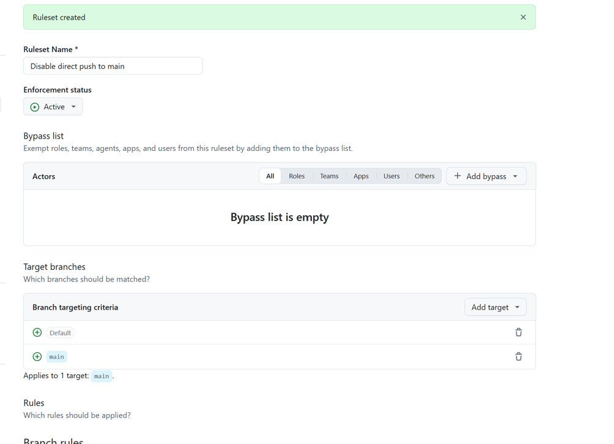

Lade branch protection på och aktiverade ruleset.

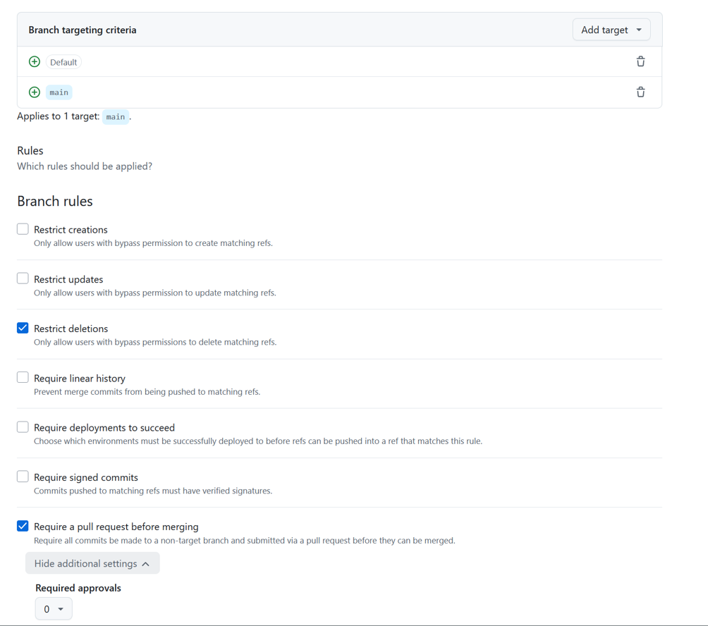

Eftersom jag gör det solo så lade ja required approvals till 0 men ändå att pull request krävs.

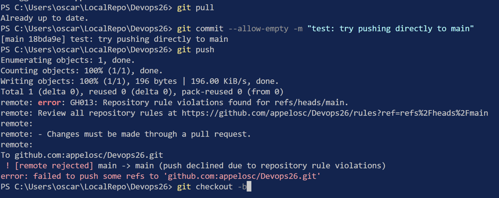

Testade pusha en empty commit direkt till main och remote avisade pushen. Branch protection
fungerar med andra ord

## Pull request och review

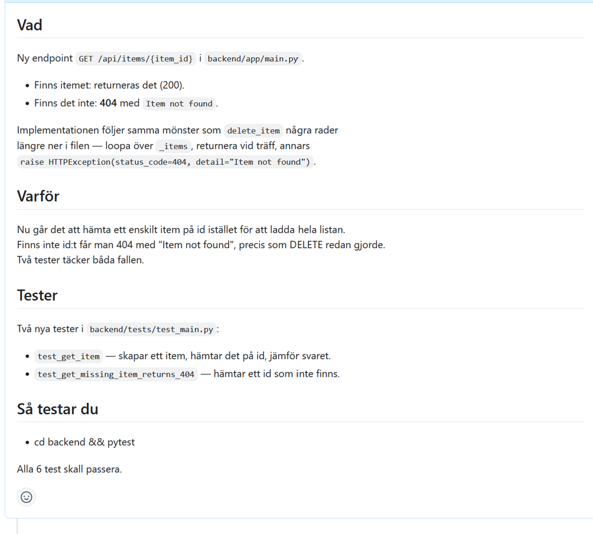

Claude kodade koden, jag öppnade pull requesten och reviewade den. Här är pull requestens beskrivining

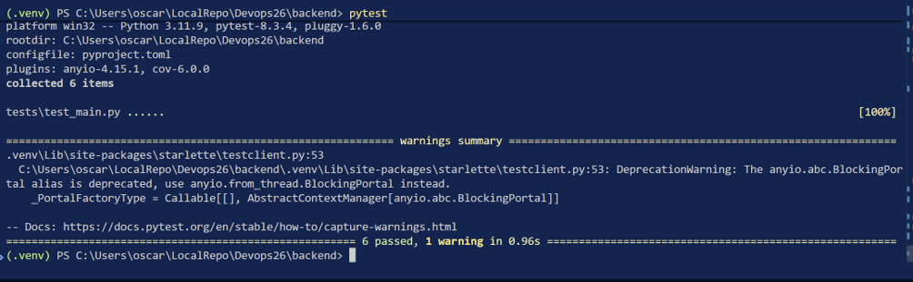

Öppnade branchen och koden i min egen workspace och körde pytest. Alla tester gick igenom. Gick även igenom koden och läste den.

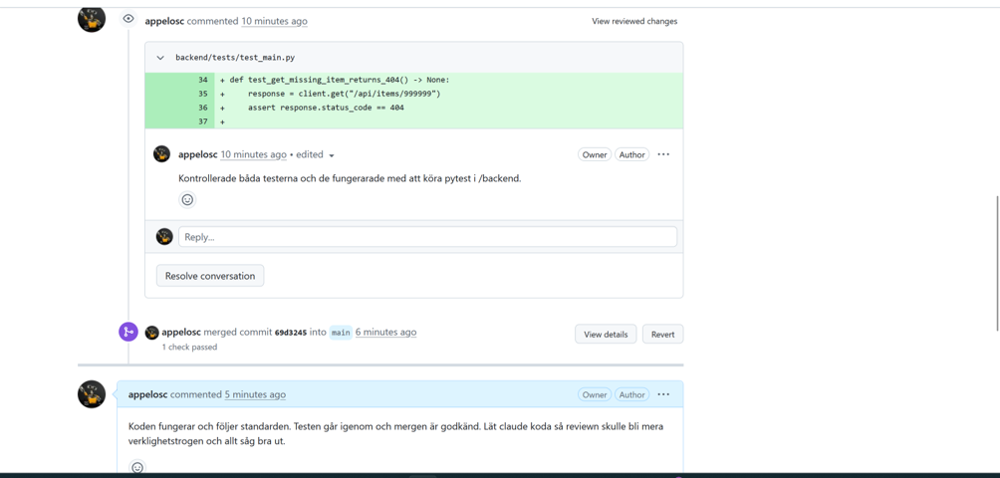

Reviewade pull requesten och kommenterade. allt var i skick så den blev mergade till main och branchen deletades.
Städade även upp min egen workspace med git branch -d get-one-item och git fetch --prune

## Merge conflict

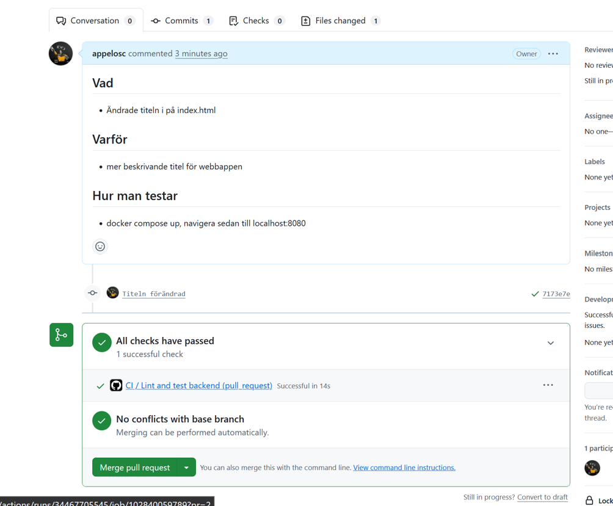

Simpel pull request för att skapa merge conflicten

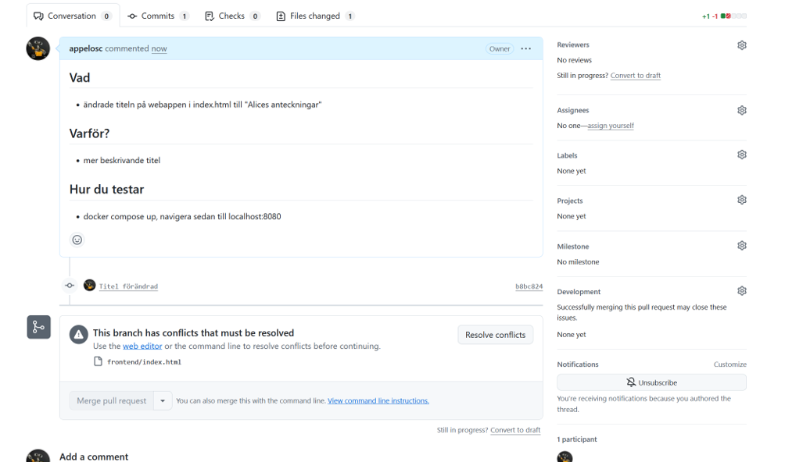

Här ser vi att vi har en merge conflict på github när jag försökte merga den andra branchen.
Gick in på branchen och körde git fetch origin samt git merge origin/main och fick felmeddelande, som vi kan se i bilden nedanför

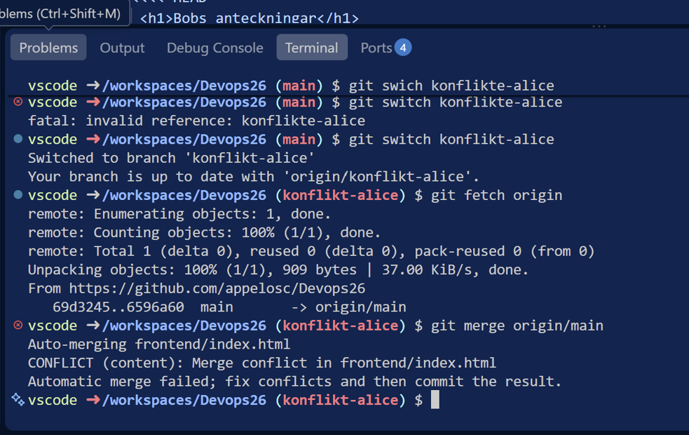

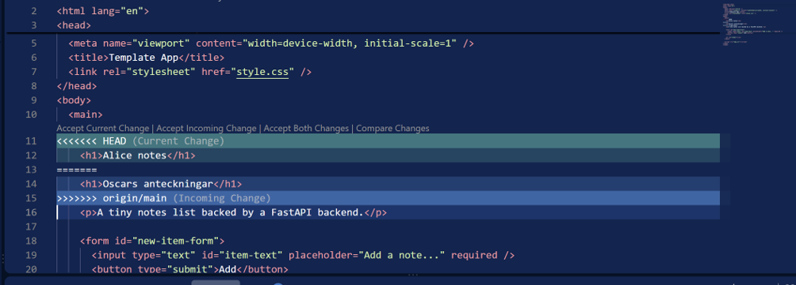

Efter detta så tog jag bort allt innom "<<<<<" och ">>>>>" och ersatte det med en kombinerad verion. committade och pushade.
Uppdaterade PR sidan på github och fanns inga konflikter. Gjorde en normal review och godkännde PR

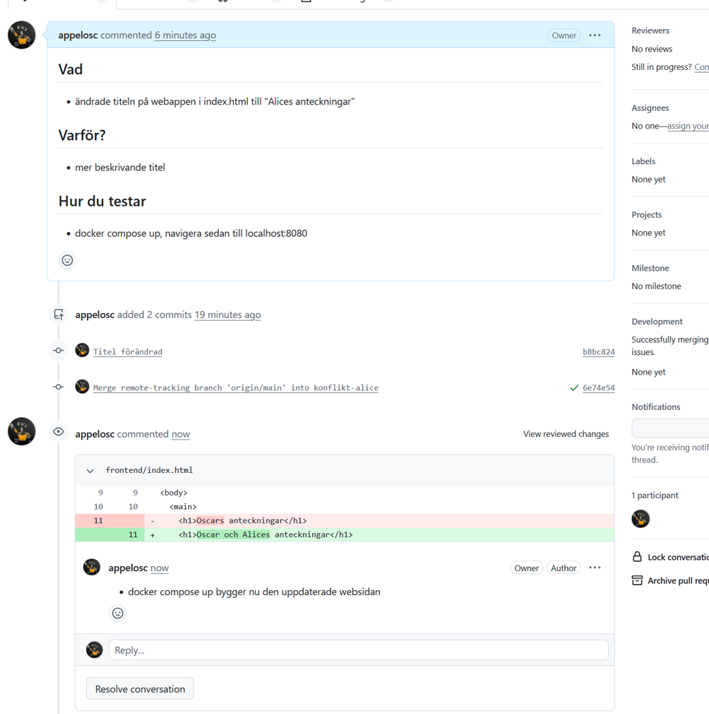
