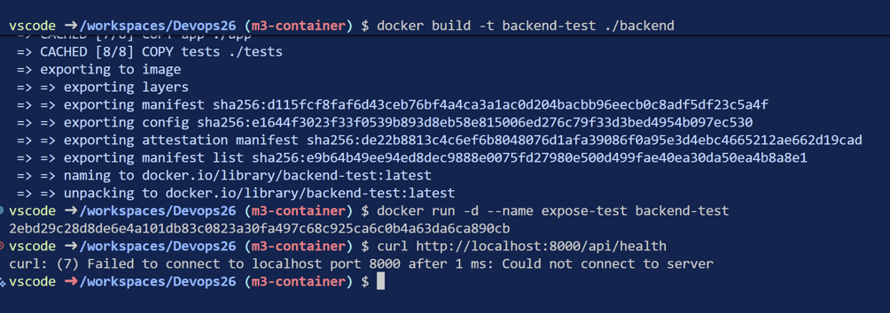
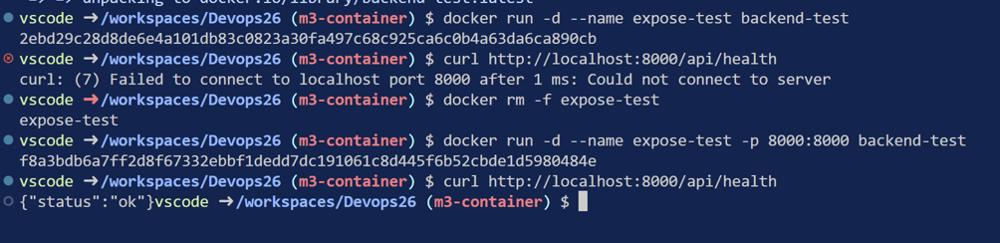
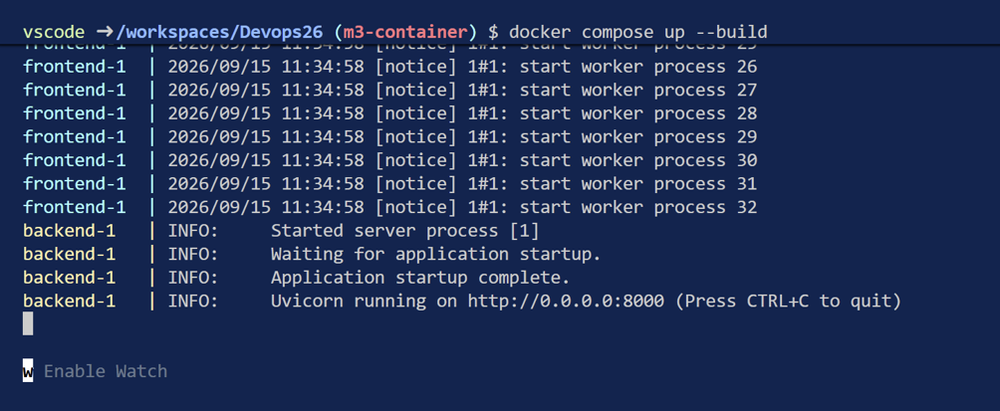
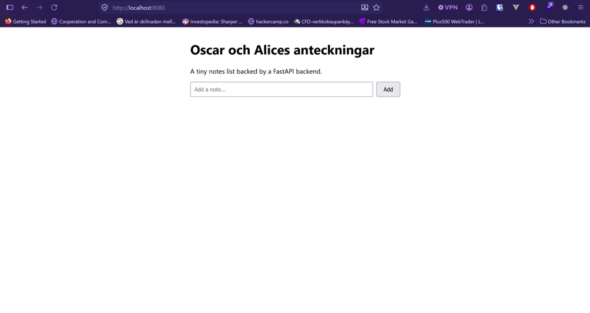
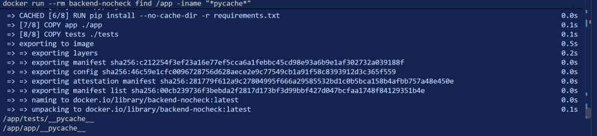
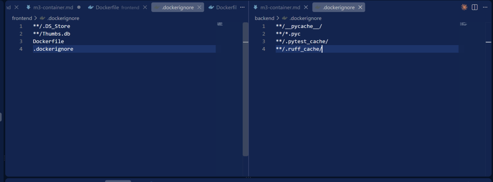
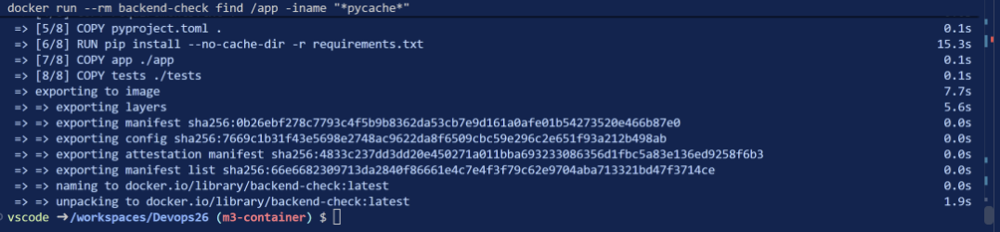
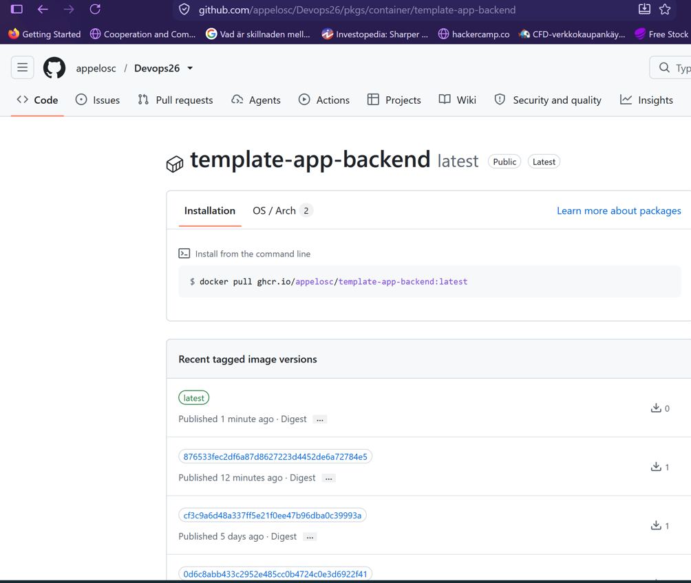
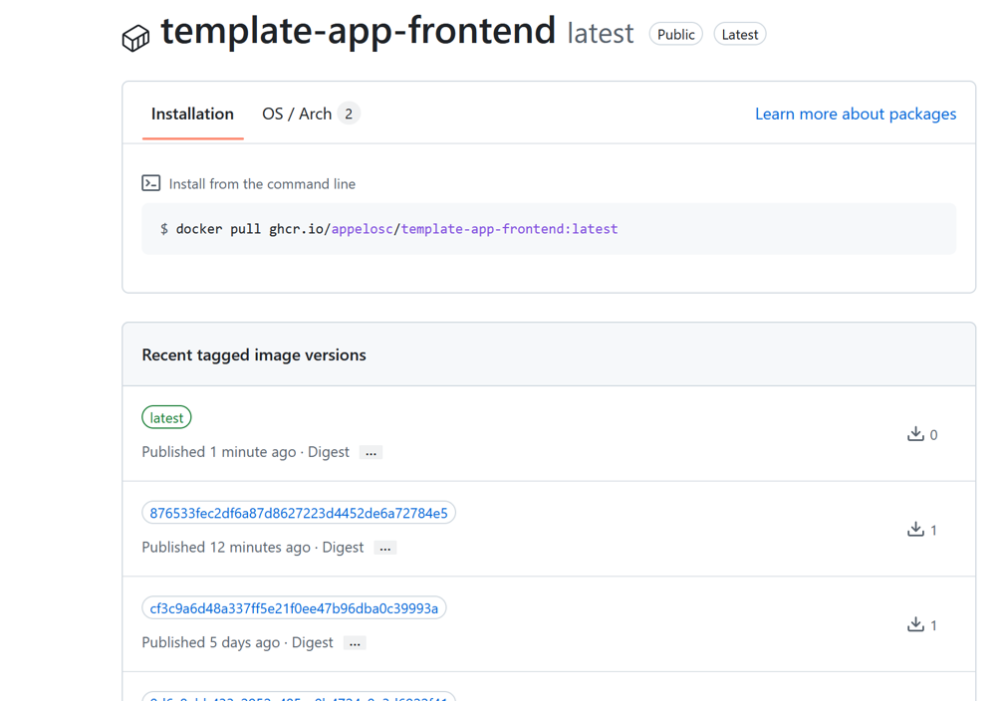

## Steg 1
1. Den första raden `FROM python:3.12-slim` avgör python versionen.

2. `COPY requirements.txt` och `RUN pip install...` kommer före COPY eftersom de installerar alla requirements och är cachade. Ifall vi ändrar någon kod i vår app så körs alla commandon EFTER app igen. Ifall de är efter `COPY app ./app` skulle köra pip install på alla requirements VARJE gång vi ändrar koden -> inte effektivt byggt image.

3. Nej. `EXPOSE 8000` är endast dokumentation i dockerfilen

Testar gissningen på riktigt:

curl anropet misslyckas

curl anropet lyckas

## Steg 3 Testa containers

Testar ifall containerna byggs som de borde med `docker compose up --build`

Frontenden går att nå i webbläsaren via localhost:8080

## Steg 4 Dockerignore

pycache byggs med i vår image före vi lagar en .dockerignore

Skapar dockerignore för både `/frontend` och `/backend`

Bevis på att pychache inte mer byggs me i imagen efter `.dockerignores`

## Steg 5 GHCR

Gjorde steg 5 och loggade in med token, tagga images med latest och pushade taggade imagena till GHRC

`latest`tagg på `template-app-backend`

`latest`tagg på `template-app-frontend`

