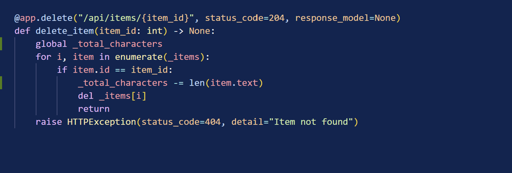
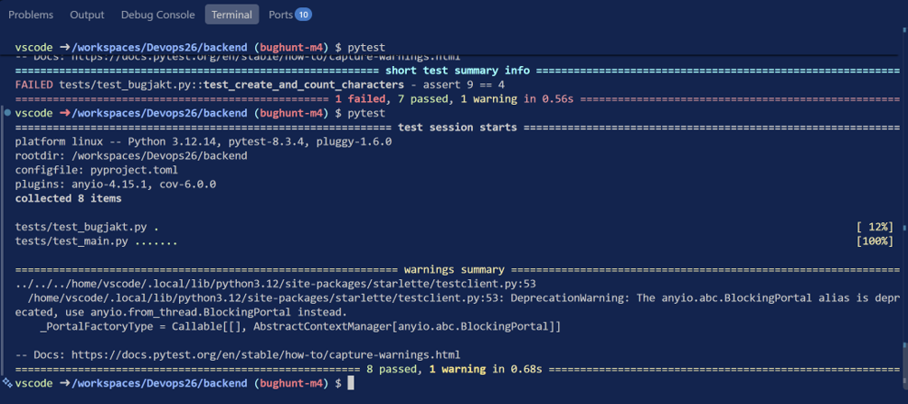

## Testet som failar.

Output från terminalen efter jag skrivit mitt test

   def test_create_and_count_characters() -> None:
        client.post("/api/items", json={"text": "milk"})
        response = client.post("/api/items", json={"text": "bread"})
        assert response.status_code == 201
        created = response.json()
    
        response = client.get("/api/items/stats")
        assert response.status_code == 200
        stats = response.json()
    
        assert stats['total_characters'] == 9
    
        client.delete(f"/api/items/{created['id']}")
        response = client.get("/api/items/stats")
        stats = response.json()
>       assert stats['total_characters'] == 4
       assert 9 == 4

tests/test_bugjakt.py:36: AssertionError 

## Hur gick detta igenom?

Jag skulle säga att detta gick igenom eftersom man hade tunnelseende och kotymen kring när/hur man skriver tester inte är som den borde. Koden funkade och alla tester gick igenom men inte ett enda test testade funktionen som visar karaktärerna på skärmen. Man lade alltså till en ny funktion utan att skriva tester som testar dens funktionalitet.

Den person som granskade koden hade också tunnelseende och borde i efterhand kanske ha granskat koden lite noggrannare. Då skulle man möjligen ha märkt att delete funktionen inte uppdaterar den globala `_total_characters`och att det saknas unit test för `_total_characters`.

Alla granskade endast ifall koden fungerar när man SKAPAR items och inte när items påverkas på andra sätt, i detta fall när man deletar.

## Fixen

Bild på kodfixen. Lade till tilläggsfunktionalitet till delete-endpointen så den även uppdaterar globala `_total_characters`

Grönt test

## Vad skulle ha behövts för att detta inte skulle ha nått main?

Kanske ett mer testorienterat arbetssätt hos teamet. Skriv test först på hur koden borde bete sig och börja koda ny funktionalitet utifrån det. Komma ihåg att alltid skriva tester för ny funktionalitet och skapa automatiserade unit tests som testar kodens basfunktionalitet vid varje försök på att merga till main. Detta är ifall hur jag tror att man skulle minska på liknande situationer i framtiden.

