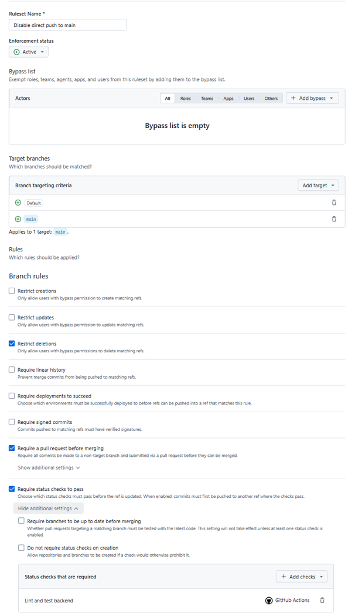
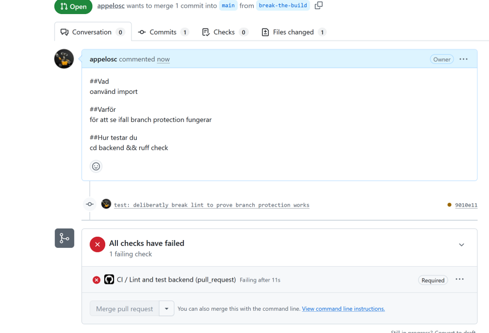
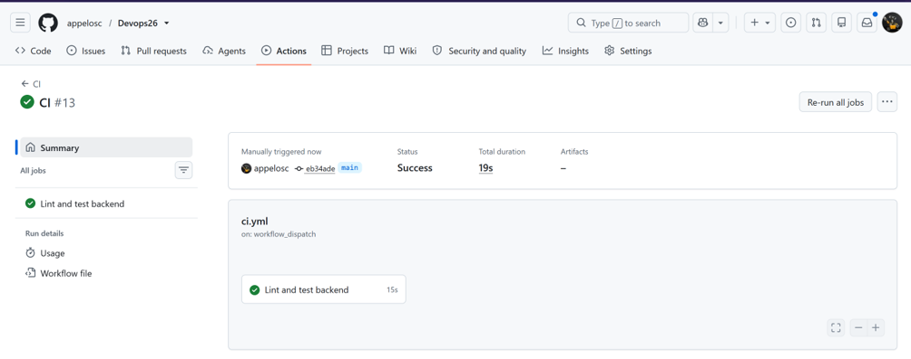

## Ruleset

Skapade ruleset och lade till `require status checks to pass` där `lint and test backend`skall köras före en merge.

## Blockad merge

Testade rulesettet genom att skapa en ruff error och skapa en pull request till main.
Bilden bevisar att regeln fungerar. Resolvade errorn och mergade.

## Manually triggered workflow

Lade till `workflow_dispatch` så man kan köra testerna manuellt. Bilden bevisar att jag kört lint and test backend via github actions på github.