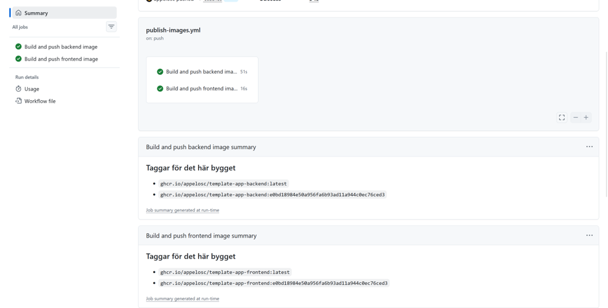
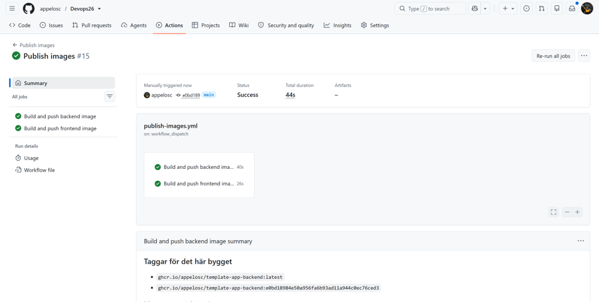
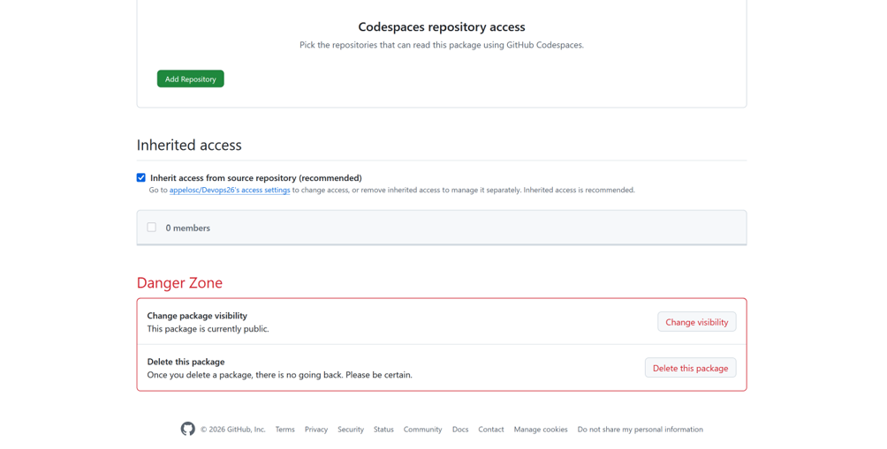
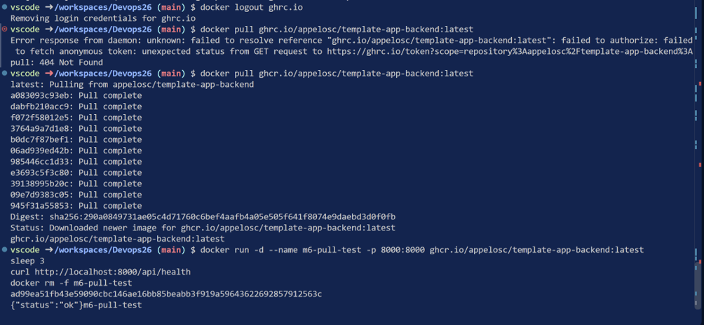
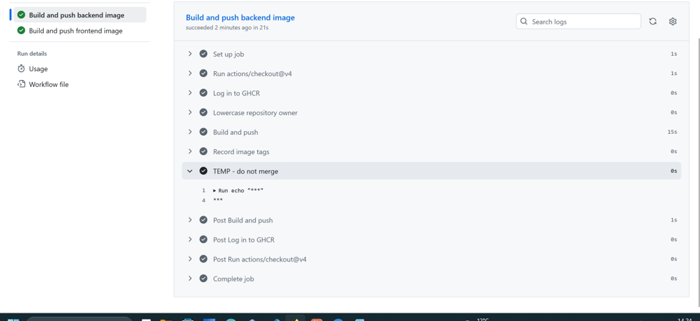

## Automatisk workflow med taggar

Kan se att workflowen triggas automatiskt och att den printar ut de taggar som imagen är taggad med, alltså sha hashen och `latest`

## Manuell workflow med taggar

Precis samma workflow bara att den nu är manuellt triggad så vi kan se att `workflow_dispatch:`fungerar

## Public packages

Mina packages var redan public från tidigare, antaglien från `M3`. Men bilden bevisar att de är det.

## Test av public packages genom ghcr logout

Terminal output på när jag testade ifall det går att pulla ner mina images utan credentials. Som vi ser så fungerar det och endpointen svara.

## Secrets masking

Testade secrets masking på sin egen branch och triggade workflowen manuellt. Enligt resultatet så maskeras GitHuben tokenen på korrekt sätt. Städade upp mina branches efter det och deletade båda lokalt och origin av branchen så den aldrig nådde main.
