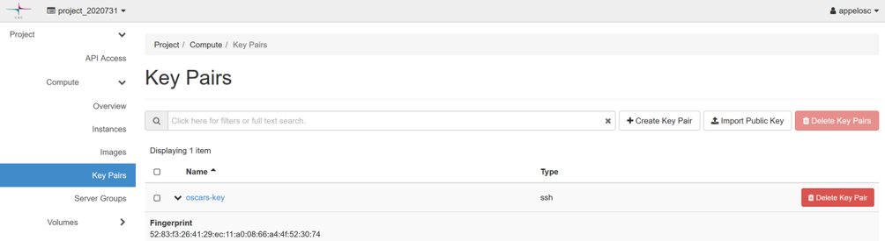
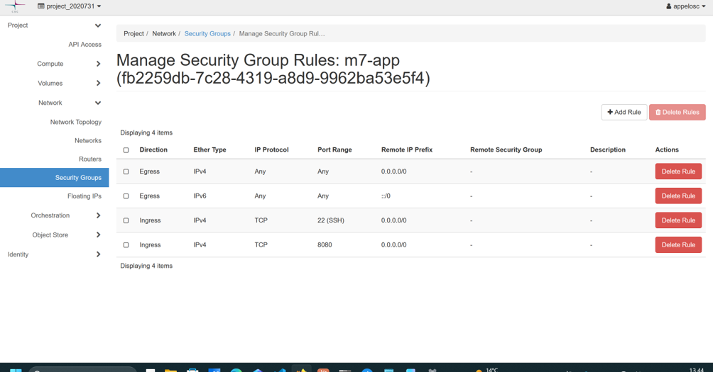
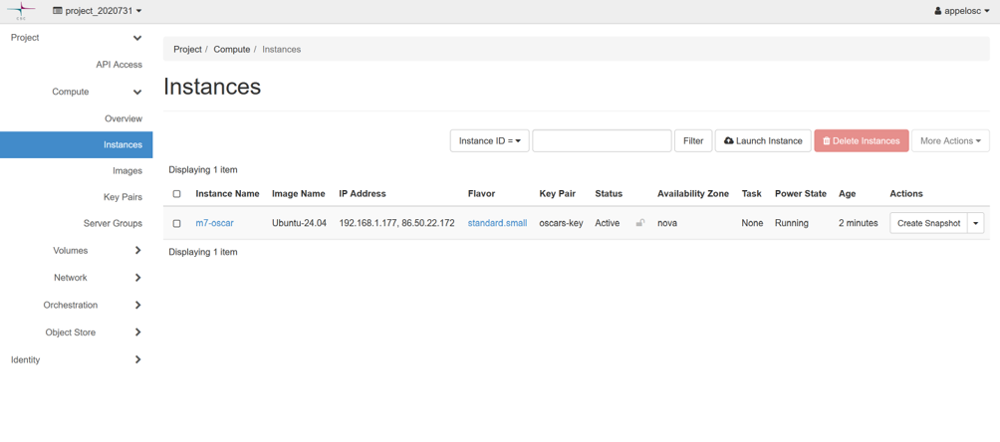
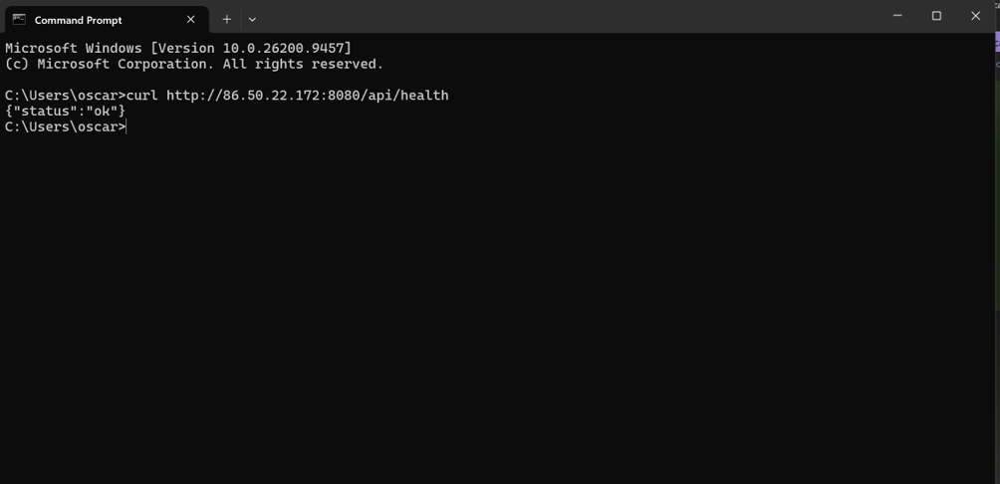
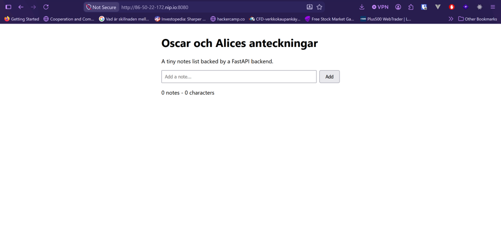

## Key pairs

Bild på ssh nyckel på pouta.

## Security group

Security group där ssh (port 22) samt custom-tcp rule med 8080 är konfigurerade

## Instances

Running instance med både floating ip och interna ip adresserna.

## Curl från egen dator

Curlade addressen från egen cmd och fick svar. Appen körs på molnet.

## Frontend i webbläsare

Frontenden går att nås i webbläsare, även via nip.io som bilden bevisar.