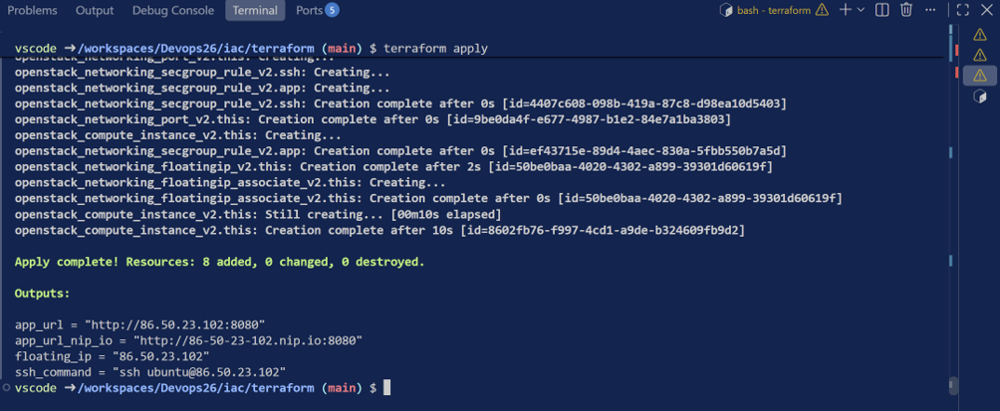
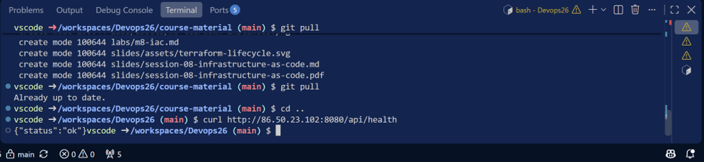
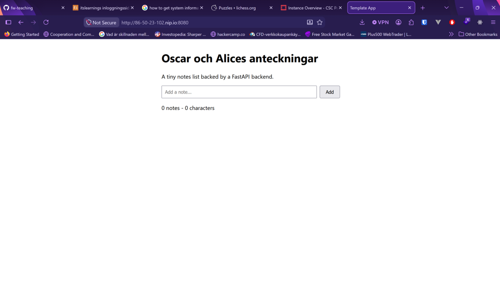
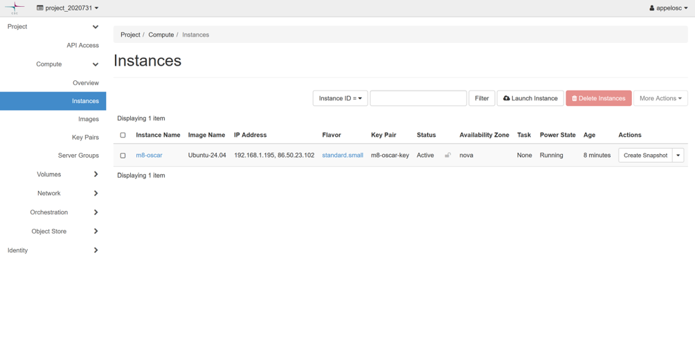
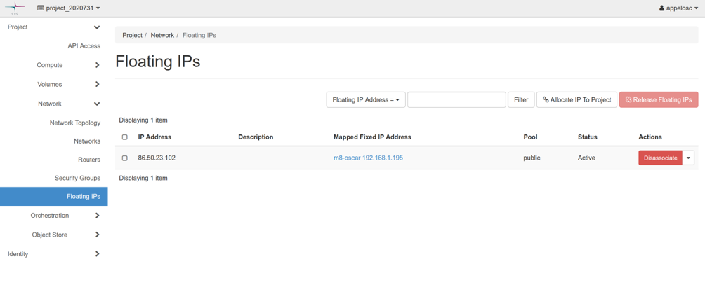
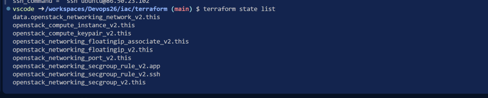
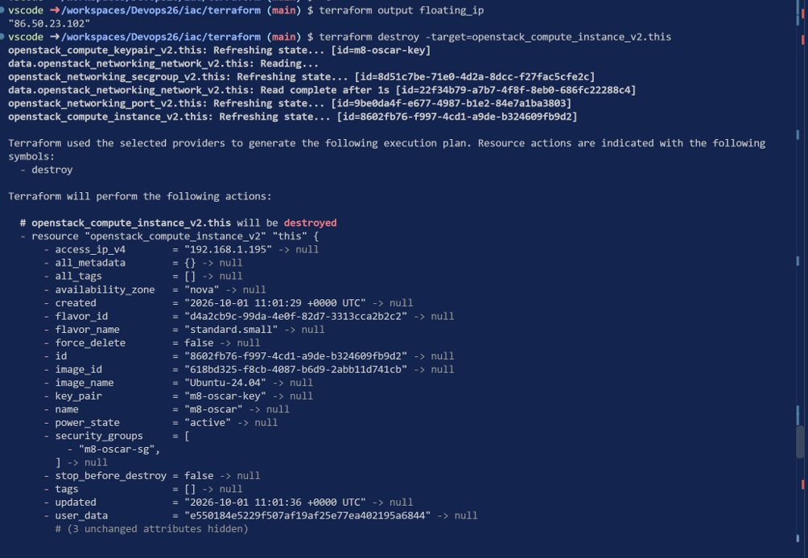
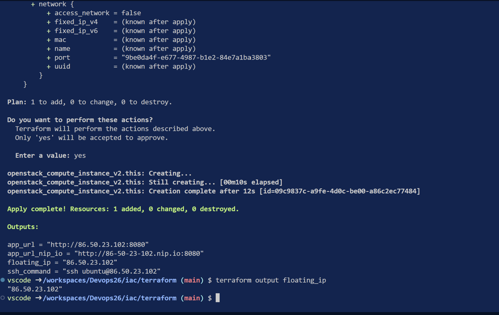
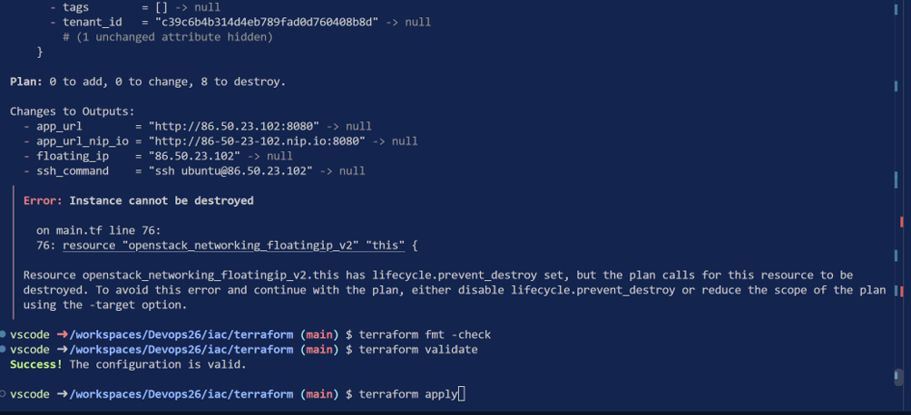

## Terraform apply

Före jag körde terraform apply så skapade jag terraform.tfvars och conffade den enligt instruktionerna. Sedan körde jag : 
```bash
terraform fmt -check
terraform init -backend=false
terraform validate
```
och fick grönt på validate. Efter det körde jag `terraform init`, `terraform plan` och sedan apply



Körde `curl`på nya med nya ip på `api/health` och det svarade som förväntat



Testade frotenden i browsern med den nya IP-adressen och även det lyckades




## Instance removal och Floating IP dissassociation

Tog bort m7 instance vi skapade manuellt.



Efter det dissasocierade jag även den gamla floating-ip så den frias upp.



## Terraform state  + Terraform destroy



Terraform state visar den nuvarande staten terraform har av våra cloud resurser.

Outputtade floating ip och destroyade vår vm vi just byggde up med terraform



Efter det körde jag `terraform apply` igen och kollade floating ip. Den är samma som den var före  vi destroyade alltså sparas den som den borde.



## BONUS

Testade köra terraform destoy utan en flag för att se ifall terraform stoppar det som den borde. Fick exakt den varning som beskrevs i instruktionerna.

