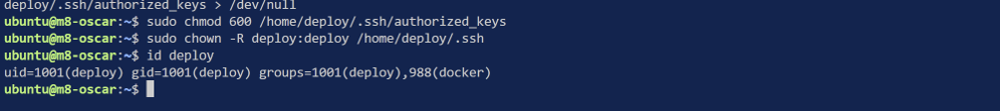
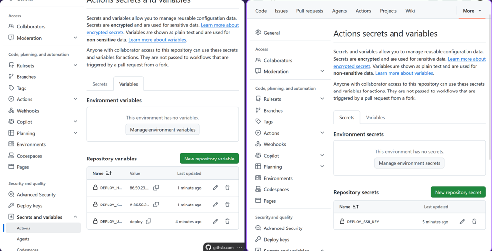
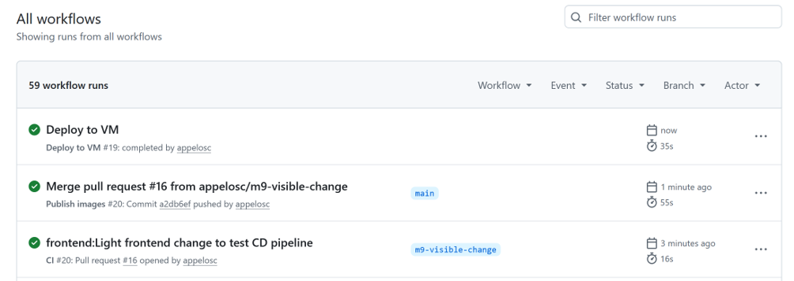
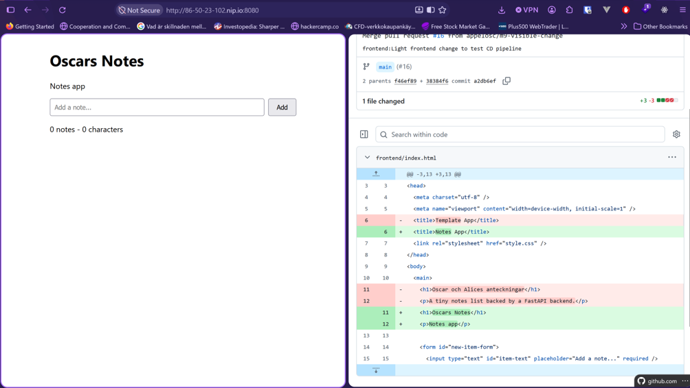

## Deploy + docker group på VM

Bild på att deploy användaren existerar samt att den är medlem i docker gruppen.

## Variables and Secrets on GitHub

Lade in privata ssh nyckeln på github som secret och resten som variabler.

## Workflow runs passed

Efter detta ändrade jag om titeln + en paragraf och gjorde en pr som jag mergade. Alla wotrkflows blev gröna och gick igenom

## Changes seen on Frontend

Nya ändringar kan ses på frontenden via nip.io urlen.

